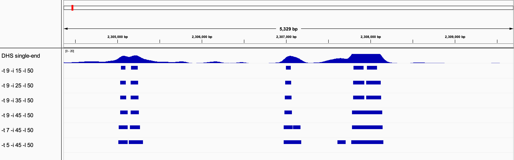

# Popera

### DNase I hypersensitive sites identification

### Dependencies:

* samtools http://samtools.sourceforge.net

* pysam http://code.google.com/p/pysam/

* scipy http://www.scipy.org

* numpy http://www.numpy.org

* pyBigWig https://github.com/deeptools/pyBigWig

**Author: Tao Zhang @ UW-Madison & YZU**

### Example: 
```
$ python Popera.py -d DNase.bam -n DNase --bigwig --threads 8
```


### Options:

*  --version             show program's version number and exit
*  -h, --help            show this help message and exit.
*  -d DATAFILE, --data=DATAFILE
                        data file, should be sorted bam format
*  -n SAMPLENAME, --name=SAMPLENAME
                        NH sample name default=NH_sample
*  -b BW, --bandwidth=BW
                        kernel smooth band width, should >1, default=200
*  -t THRESHOLD, --threshold=THRESHOLD
                        Hot spots threshold, default=4.0

*  -l MINLENGTH, --minlength=MINLENGTH
                        minimum length of hot spots, default=50

*  -i initiallength,      Peak's initial length, >1 and <minlength, default=25

*  -p pvalue,             p-value cutoff for peak identification, default=0.05

*  --threads=NTHREADS    threads number or cpu number, default=4

*  --bigwig              whether out put bigwig file, default=False

*  -x EXCLUDECHR, --excludechr=EXCLUDECHR
                        Don't count those DHs, example='-x ChrM,ChrC'

### The output file:

<table>
  <tr>
    <td>1. chrom</td>
    <td>Name of the chromosome</td>
  </tr>
  <tr>
    <td>2. chromStart</td>
    <td>Starting position of the peak (0-based)</td>
  </tr>
  <tr>
    <td>3. chromEnd</td>
    <td>Ending position of the peak</td>
  </tr>
  <tr>
    <td>4. name</td>
    <td>peak name</td>
  </tr>
  <tr>
    <td>5. pvalue</td>
    <td>-log<sub>10</sub>(pvalue)</td>
  </tr>
  <tr>
    <td>6. strand</td>
    <td><code>.</code> (no orientation)</td>
  </tr>
</table>

### Parameters example
<figure>
  
</figure>

What is Popera?
http://en.wikipedia.org/wiki/Operatic_pop


#### Reference
Zhang T, Marand A, Jiang JM*: [PlantDHS: A Database for DNase I Hypertensive Sites in Plants.](https://academic.oup.com/nar/article/44/D1/D1148/2503132) Nucleic Acids Research 2016, 44(D1): D1148-D1153.
